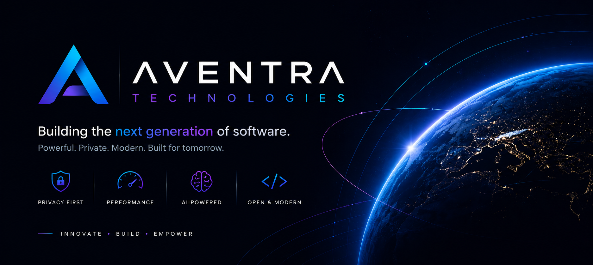

  

# Aventra LLC

### Privacy-first desktop software for focused builders.

We build local-first tools that help developers, creators, and teams stay productive without giving up control over their data.

---

## What We Build

Aventra focuses on polished desktop products with modern interfaces, offline-capable workflows, and practical developer integrations.

- **Local-first experiences**: core data stays on the user's machine whenever possible.
- **Developer-centered workflows**: tools designed around projects, tasks, repositories, releases, and daily engineering work.
- **Modern desktop stack**: Electron, React, TypeScript, SQLite/sql.js, Vite, Tailwind CSS, Framer Motion, and related tools.
- **Privacy by design**: optional cloud or GitHub integrations should enhance the workflow without becoming a requirement.

## Public Projects

| Project | Description | Stack |
| :--- | :--- | :--- |
| [Flux Tasks](https://github.com/Aventra-Technologies/Flux-Tasks) | Premium offline-first project manager and development hub with local SQLite storage, privacy by design, and optional encrypted GitHub integration. | Electron, React, TypeScript, SQLite |
| [Bamboo Browser](https://github.com/Aventra-Technologies/Bamboo-Browser) | Premium desktop browser project built as a modern Electron application. | Electron, React, TypeScript, Vite |

## Engineering Principles

- **Own your workspace**: software should feel fast, personal, and dependable even without a network connection.
- **Respect private data**: sensitive credentials and local project data should be handled carefully and intentionally.
- **Ship beautiful tools**: productivity software can be practical, refined, and enjoyable at the same time.
- **Build for real workflows**: integrations should support how people actually plan, code, release, and maintain projects.

## Repository Highlights

### Flux Tasks

Flux Tasks is an offline-first project manager and development hub for people who want project planning, tasks, code snippets, attachments, roadmaps, exports, and optional GitHub integration in a desktop app.

It is designed around local storage, encrypted token handling, and a workflow that remains useful with or without GitHub connected.

### Bamboo Browser

Bamboo Browser is a premium desktop browser project built with Electron and a modern React/TypeScript frontend stack.

## Connect

- GitHub organization: [github.com/Aventra-Technologies](https://github.com/Aventra-Technologies)
- Projects: [Flux Tasks](https://github.com/Aventra-Technologies/Flux-Tasks) and [Bamboo Browser](https://github.com/Aventra-Technologies/Bamboo-Browser)

---

  Built by Aventra LLC.

